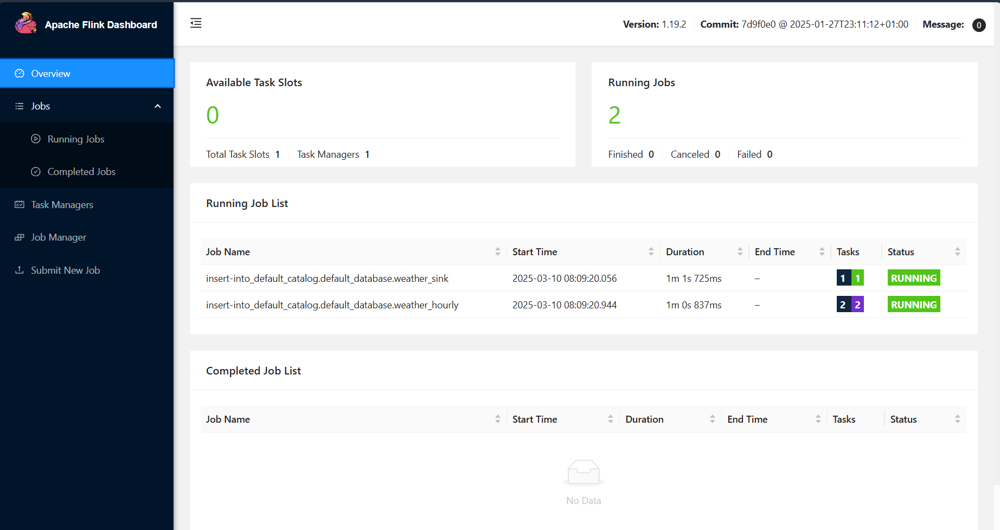
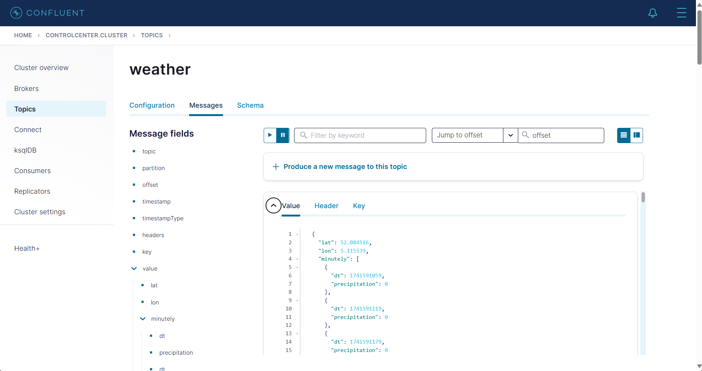
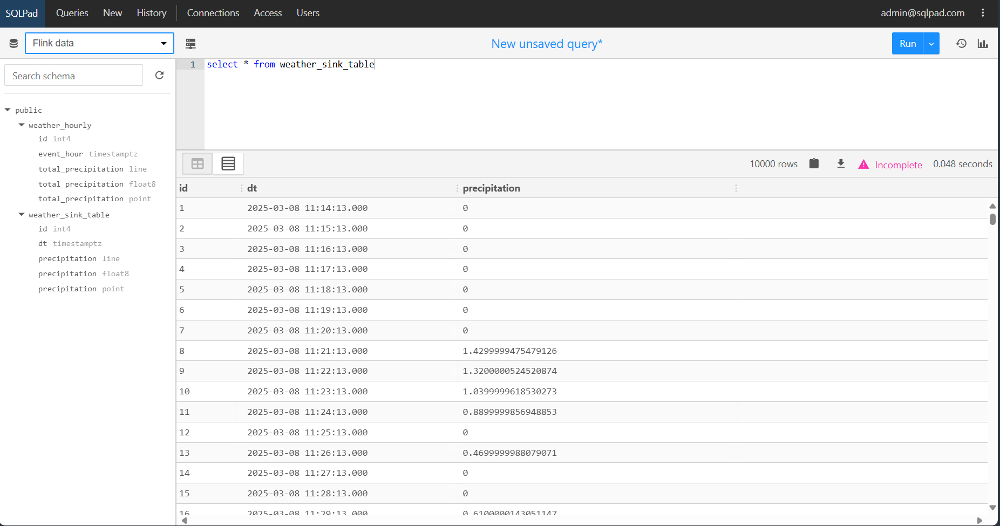
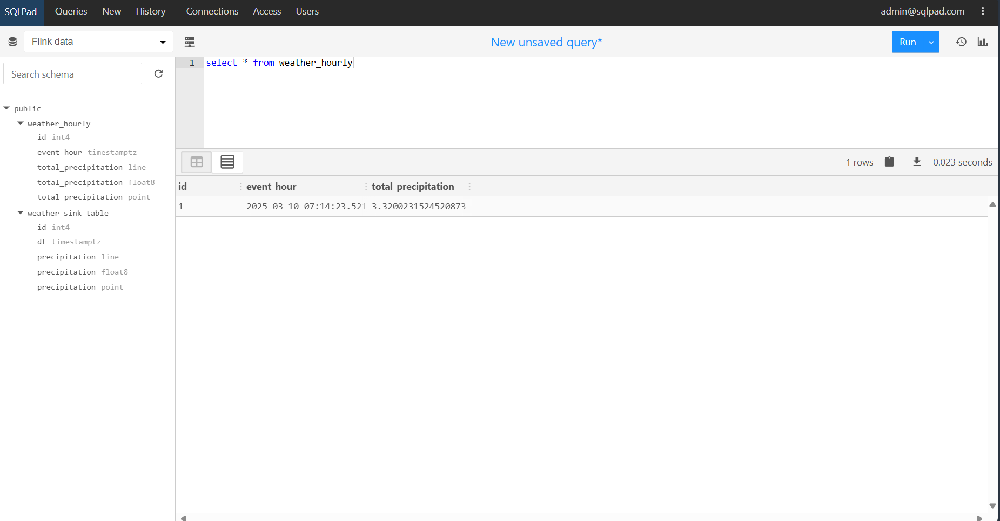

# streaming-app
The system is designed to handle high volumes of data efficiently, providing timely insights and ensuring reliability through its fault-tolerant architecture.

## Overview

When I design applications like this I try to adhere to these principles:
- Use as much standardized technology as possible: this creates a future proof solution
and helps to keep an overview. In addition it will be easier for someone else to
contribute to the project.
- Elegant code: I am a big fan of elegance in code (and things such as Code Golf). But in Data Engineering for me an elegant pipeline means a short and effective pipeline. With standardized 
connectors and using technologies that fit well together you can create lean and mean pipelines.
- Scalability by design: One of the big revolutions during the big data craze were the improvements
in horizontal scaling compute frameworks. Even though these are projects with a minimal amount of data it's important always to think about how this will scale for larger data sets. Kafka, Flink and 
Postgresql are all technologies that have proven themselves to work with high volume and velocity data
sets.
- Engineering mindset: It's crucial to approach data engineering with a mindset focused on creating robust and reliable code. This means writing code that is not only functional but also maintainable, testable, and scalable. 


```
┌───────────────────┐    ┌──────────────────┐
│                   │    │                  │
│   Mock Service    │    │    Processor     │
│                   │    │                  │
└───────────────────┘    └──────────────────┘
    │                       │
    └───────────┬───────────┘
                │
┌───────────┐ ┌───────────┐ ┌───────────┐
│           │ │           │ │           │
│   Kafka   │ │   Flink   │ │ PostgreSQL│
│           │ │           │ │           │
└───────────┘ └───────────┘ └───────────┘
```

## Technologies Used

- **Kafka**: A distributed messaging system used for building real-time data pipelines and streaming applications.
- **Flink**: A stream processing framework that allows for real-time data processing.
- **Postgresql**: A relational database used for storing processed data.

## Features
- Real-time data processing: The system processes data as it arrives, ensuring timely insights.
- Scalable architecture: Designed to handle increasing amounts of data by scaling horizontally.
- Fault-tolerant design: Ensures the system remains operational even in the event of failures.
- Integration with Kafka: Utilizes Kafka for efficient message passing between components.
- Use of Flink: Employs Flink for robust stream processing capabilities.
- Postgresql for data storage: Stores processed data in a reliable and widely-used relational database.
- Mock service: Facilitates testing and development by simulating real data inputs.
- Detailed documentation and examples: Provides comprehensive guides and examples to help users understand and utilize the system.
- KRaft: Uses Kafka Raft (KRaft) mode, eliminating the need for Zookeeper.

## Notes
- Use either the mock service or the actual API, defined in `example.env`. You do need to have an api key for Openweathermap though.
- URLs:
    - [Apache Flink Dashboard](http://localhost:8081/)
    - [Kafka Control Center](http://localhost:8081/)
    - [Sqlpad](http://localhost:3000/) (sign in with `admin@sqlpad.com` and `admin` as password)
- Everything was build on an Intel x86 machine (no ARM!) OS details: Microsoft Windows 11 Pro Version 10.0.26100 Build 26100

## Screenshots






## Shortcomings
- The only main issue I have is that the hourly aggregation doesn't work properly (this is one of the main functions but I simply
had no time to debug anymore), it only aggregates over an entire hour so it takes long to see the results
- I had issues with the group_by function and postgresql/jdbc sink because it complained about primary keys not being set
correctly. I expect that this is a bug in the Flink libraries.
- To get this to work with the appropriate libraries I had to go through the Java dependecy hell (which was terrible). Everything
should work properly now running stand-alone just by executing the docker-compose file. I tried to fix a lot of versions in place
so hopefully this will keep working over time.